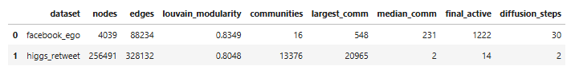

# SocialMediaAnalytics-Assignment2
Louvain community detection + Linear Threshold (information diffusion) on two real social graphs, with visualizations and analysis. Built for Group 9 – Set 2.

# Overview
- Algorithms:

    - Community detection: Louvain (modularity optimization)

    - Information diffusion: Linear Threshold (LT) model

- Datasets (from SNAP):

    - Facebook (ego) – undirected social graph

    - Higgs Twitter – retweet – directed, temporal; used as directed for diffusion and undirected view for modularity

- Artifacts: comparison tables, community size distributions, diffusion curves, graph snapshots + GIFs, and community quality metrics.

# Repo structure
```cmd
.
├─ data/                # auto-downloaded datasets (.txt/.edgelist)
├─ outputs/
│  ├─ plots/            # PNGs + GIFs saved here
│  ├─ results_summary.csv
│  ├─ facebook_* and higgs_* CSVs (metrics, histories)
├─ SMA_Set2_Louvain_LT.ipynb
└─ README.md
```
-------------------------------------------
# Quick start
## 1) Environment

```
# (recommended) create a venv
python -m venv .venv
# Windows
.\.venv\Scripts\Activate.ps1
# macOS/Linux
source .venv/bin/activate

# install dependencies
python -m pip install -U pip
python -m pip install jupyterlab networkx matplotlib pandas python-louvain imageio
```

## 2) Run the notebook
```
jupyter notebook
```

- Open SMA_Set2_Louvain_LT.ipynb and Run All.
- The notebook will:
    - create ./data, ./outputs, ./outputs/plots
    - download the two SNAP datasets
    - run Louvain and LT diffusion
    - save CSVs/PNGs/GIFs into ./outputs/

## What gets saved
- Comparison table: outputs/results_summary.csv

- Community metrics (top communities):

    - outputs/facebook_community_metrics_top100.csv

    - outputs/higgs_community_metrics_top100.csv

- Community size plots:

    - outputs/plots/facebook_comm_size_{hist,cdf}.png

    - outputs/plots/higgs_comm_size_{hist,cdf}.png

- Community visuals (sampled subgraph):

    - outputs/plots/facebook_communities.png

    - outputs/plots/higgs_communities.png

- Diffusion:

    - Curves: outputs/plots/{facebook,higgs}_diffusion.png

    - GIFs + step frames: outputs/plots/{facebook,higgs}_diffusion.gif and _step*.png

    - Histories: outputs/{facebook,higgs}_diffusion_history.csv

- Sensitivity & seeding analysis (Facebook):

    - outputs/facebook_sensitivity_seeding.csv

    - outputs/plots/facebook_sensitivity_seeding.png

- Community-aware vs top-degree seeding:

    - outputs/plots/facebook_commaware_vs_degree.png

- Auto-summary text: outputs/auto_summary.txt

## Sample results (from our run) 
#### Values can vary slightly with thresholds/seed.



# Takeaways (short):

- Facebook shows strong community structure (high modularity) and broad diffusion under random θ.

- Higgs RT is highly fragmented (many tiny communities); diffusion with random θ barely propagates.

- Seeding matters: degree/PageRank seeding outperforms random; community-aware seeding achieves wider coverage at moderate θ.

# Troubleshooting

- If Jupyter doesn’t open a browser, copy the terminal URL with the ?token= into your browser.

- Spring layout plotting can be slow on very large graphs; we plot sampled subgraphs for clarity.

- If louvain_communities isn’t found (older NetworkX), the notebook automatically falls back to python-louvain.

# References

- Blondel et al., Fast unfolding of communities in large networks (Louvain).

- Kempe, Kleinberg, Tardos, Maximizing the spread of influence through a social network (LT/IC models).

- SNAP datasets: Facebook combined graph, Higgs Twitter retweet network.